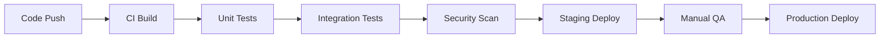

# 📋 SDLC Documentation Package

## E-Commerce Mobile Application

A comprehensive Software Development Life Cycle (SDLC) documentation package for a React Native e-commerce application built with Supabase backend services.

---

## 📁 Documentation Structure

### Core SDLC Documents

| Document                                                                   | Description                                                          | Key Sections                                   |
| -------------------------------------------------------------------------- | -------------------------------------------------------------------- | ---------------------------------------------- |
| **[📋 01_Analysis_Requirements.md](docs/01_Analysis_Requirements.md)**     | Business requirements, user personas, and functional specifications  | User Stories, Acceptance Criteria, Constraints |
| **[🏗️ 02_System_Design.md](docs/02_System_Design.md)**                     | System architecture, database design, and technical specifications   | Architecture Diagrams, ERD, API Design         |
| **[💻 03_Implementation_Overview.md](docs/03_Implementation_Overview.md)** | Technology stack, implementation details, and development guidelines | Tech Stack, State Management, Security         |
| **[🧪 04_Testing_Documentation.md](docs/04_Testing_Documentation.md)**     | Testing strategy, test cases, and quality assurance procedures       | Test Plans, UAT Criteria, Automation           |
| **[📊 05_Presentation_Materials.md](docs/05_Presentation_Materials.md)**   | Presentation slides, demo scripts, and stakeholder materials         | Demo Scripts, Team Contributions               |

### Operational Documents

| Document                                          | Description                                       | Purpose                               |
| ------------------------------------------------- | ------------------------------------------------- | ------------------------------------- |
| **[🚀 DEPLOYMENT_GUIDE.md](DEPLOYMENT_GUIDE.md)** | Production deployment procedures and checklists   | Step-by-step deployment to production |
| **[🔧 TROUBLESHOOTING.md](TROUBLESHOOTING.md)**   | Issue resolution procedures and diagnostic guides | Problem-solving and maintenance       |

### Project Documentation

| Document                                  | Description                                       | Purpose                                |
| ----------------------------------------- | ------------------------------------------------- | -------------------------------------- |
| **[🤝 CONTRIBUTING.md](CONTRIBUTING.md)** | Contribution guidelines and GitHub best practices | Developer onboarding and contribution  |
| **[📝 CHANGELOG.md](CHANGELOG.md)**       | Version history and release notes                 | Change tracking and release management |
| **[📄 LICENSE.md](LICENSE.md)**           | MIT license terms and conditions                  | Legal usage and distribution rights    |
| **[📖 GLOSSARY.md](GLOSSARY.md)**         | Technical terms and definitions                   | Terminology reference                  |

### Visual Assets

| Folder                        | Contents                                  | Format         |
| ----------------------------- | ----------------------------------------- | -------------- |
| **[📈 diagrams/](diagrams/)** | System architecture and database diagrams | Mermaid (.mmd) |
| **[🖼️ images/](images/)**     | Screenshots and visual assets             | PNG/JPG        |

---

## 🏗️ System Overview

### Architecture

```
┌─────────────────┐    ┌─────────────────┐    ┌─────────────────┐
│   React Native  │    │   Node.js API   │    │   Supabase      │
│   Mobile App    │◄──►│   (Express)     │◄──►│   PostgreSQL    │
│                 │    │                 │    │   Database      │
│ • Expo SDK      │    │ • REST API      │    │ • Real-time     │
│ • Zustand       │    │ • JWT Auth      │    │ • Auth Service  │
│ • Navigation    │    │ • Validation    │    │ • Storage       │
└─────────────────┘    └─────────────────┘    └─────────────────┘
```

### Key Features

- ✅ **User Authentication** - Secure login/signup with Supabase Auth
- ✅ **Product Catalog** - Browse products by category with search
- ✅ **Shopping Cart** - Add/remove items with persistent storage
- ✅ **Order Management** - Complete checkout and order tracking
- ✅ **Admin Panel** - Product and order management interface
- ✅ **Real-time Updates** - Live inventory and order status updates
- ✅ **Offline Support** - Basic functionality without internet
- ✅ **Cross-platform** - iOS and Android compatibility

### Technology Stack

#### Frontend (Mobile)

- **Framework:** React Native 0.81.5
- **Platform:** Expo SDK 54+
- **State Management:** Zustand
- **Navigation:** Expo Router
- **Styling:** NativeWind (Tailwind CSS)
- **HTTP Client:** Native fetch API

#### Backend (API)

- **Runtime:** Node.js
- **Framework:** Express.js
- **Database:** Supabase PostgreSQL
- **Authentication:** JWT with Supabase
- **Validation:** Custom middleware
- **CORS:** Configured for mobile origins

#### Database & Services

- **Primary Database:** Supabase PostgreSQL
- **Authentication:** Supabase Auth
- **File Storage:** Supabase Storage
- **Real-time:** Supabase Realtime
- **Hosting:** Railway/Render/Vercel

---

## 📊 Project Metrics

### Development Timeline

- **Planning & Design:** 2 weeks
- **Core Development:** 8 weeks
- **Testing & QA:** 3 weeks
- **Deployment:** 1 week
- **Total Duration:** 14 weeks

### Team Structure

- **Product Owner:** 1 person
- **UI/UX Designer:** 1 person
- **Frontend Developers:** 2 people
- **Backend Developer:** 1 person
- **QA Engineer:** 1 person
- **DevOps Engineer:** 1 person

### Code Quality Metrics

- **Test Coverage:** > 80%
- **Performance Score:** > 90 (Lighthouse)
- **Security Audit:** Passed
- **Accessibility:** WCAG 2.1 AA compliant

---

## 🚀 Quick Start

### Prerequisites

- Node.js 18+
- npm or yarn
- Expo CLI
- Supabase account
- iOS Simulator or Android Emulator

### Installation

#### 1. Clone Repository

```bash
git clone https://github.com/your-org/ecommerce-mobile-app.git
cd ecommerce-mobile-app
```

#### 2. Install Dependencies

```bash
# Backend
cd backend
npm install

# Mobile App
cd ../mobile
npm install
```

#### 3. Environment Setup

```bash
# Copy environment files
cp backend/.env.example backend/.env
cp mobile/.env.example mobile/.env

# Configure Supabase credentials
# Edit .env files with your Supabase project details
```

#### 4. Database Setup

```bash
# Run Supabase migrations
cd backend
npx supabase db push

# Seed initial data
npx supabase db reset
```

#### 5. Start Development Servers

```bash
# Terminal 1: Start API server
cd backend
npm run dev

# Terminal 2: Start mobile app
cd mobile
npx expo start
```

### Testing

```bash
# Run unit tests
npm test

# Run integration tests
npm run test:integration

# Run E2E tests
npm run test:e2e
```

---

## 📋 Development Workflow

### Branching Strategy

```
main (production)
├── develop (integration)
│   ├── feature/user-auth
│   ├── feature/product-catalog
│   ├── feature/shopping-cart
│   └── feature/order-management
```

### Code Quality Gates

- ✅ **Pre-commit:** ESLint, Prettier
- ✅ **Pull Request:** Code review, tests pass
- ✅ **Merge:** CI/CD pipeline successful
- ✅ **Release:** Manual QA approval

### Deployment Pipeline



---

## 🔍 Key Technical Decisions

### Architecture Choices

#### Why React Native + Expo?

- **Cross-platform:** Single codebase for iOS and Android
- **Rapid Development:** Hot reload and fast refresh
- **Native Performance:** Direct access to device features
- **Large Ecosystem:** Extensive library support

#### Why Supabase?

- **Integrated Solution:** Database, Auth, Storage, Real-time
- **PostgreSQL Power:** Advanced querying and relationships
- **Real-time Features:** Live updates without complex setup
- **Security:** Built-in RLS and authentication

#### Why Zustand for State?

- **Lightweight:** Minimal boilerplate compared to Redux
- **TypeScript Support:** Excellent type safety
- **Performance:** Optimized re-renders
- **Simplicity:** Easy to learn and use

### Database Design Decisions

#### Single Table Inheritance for Products

```sql
-- Products table handles multiple product types
CREATE TABLE products (
  id UUID PRIMARY KEY DEFAULT gen_random_uuid(),
  name TEXT NOT NULL,
  description TEXT,
  price DECIMAL(10,2) NOT NULL,
  category TEXT NOT NULL,
  metadata JSONB, -- Flexible attributes per category
  created_at TIMESTAMP DEFAULT NOW()
);
```

#### JSONB for Flexible Attributes

- **Product Variants:** Colors, sizes stored as JSON
- **Search Filters:** Dynamic filtering capabilities
- **Extensibility:** Easy to add new product attributes

---

## 🧪 Testing Strategy

### Test Pyramid

```
End-to-End Tests (10%)
  ↕️
Integration Tests (20%)
  ↕️
Unit Tests (70%)
```

### Test Categories

#### Unit Tests

- **Components:** UI rendering and interactions
- **Hooks:** State management and side effects
- **Utilities:** Helper functions and business logic
- **API Calls:** Mocked external service calls

#### Integration Tests

- **API Endpoints:** Full request/response cycles
- **Database Operations:** CRUD operations with real DB
- **Authentication Flow:** Login/signup/user management
- **State Management:** Store updates and persistence

#### End-to-End Tests

- **User Journeys:** Complete user workflows
- **Cross-platform:** iOS and Android testing
- **Performance:** Load and stress testing
- **Accessibility:** Screen reader and keyboard navigation

---

## 🔒 Security Measures

### Authentication & Authorization

- **JWT Tokens:** Secure token-based authentication
- **Password Policies:** Strong password requirements
- **Session Management:** Automatic token refresh
- **Role-based Access:** Admin vs regular user permissions

### Data Protection

- **Encryption:** Data encrypted at rest and in transit
- **Input Validation:** Server-side validation for all inputs
- **SQL Injection Prevention:** Parameterized queries
- **XSS Protection:** Content sanitization

### API Security

- **Rate Limiting:** Prevent abuse and DoS attacks
- **CORS Policy:** Restrict cross-origin requests
- **API Keys:** Secure service-to-service communication
- **Audit Logging:** Track all sensitive operations

---

## 📈 Performance Optimizations

### Frontend Optimizations

- **Code Splitting:** Lazy load screens and components
- **Image Optimization:** Compressed images with fallbacks
- **List Virtualization:** Efficient rendering of large lists
- **Memoization:** Prevent unnecessary re-renders

### Backend Optimizations

- **Database Indexing:** Optimized queries with proper indexes
- **Caching Strategy:** Redis for session and data caching
- **Connection Pooling:** Efficient database connection management
- **API Response Compression:** Gzip compression for responses

### Mobile Optimizations

- **Bundle Size:** Tree shaking and dead code elimination
- **Asset Optimization:** CDN delivery for static assets
- **Offline Support:** Service worker for caching
- **Battery Optimization:** Efficient background processing

---

## 🔄 CI/CD Pipeline

### Automated Workflows

#### Pull Request Checks

```yaml
name: PR Checks
on: [pull_request]
jobs:
  test:
    runs-on: ubuntu-latest
    steps:
      - uses: actions/checkout@v3
      - uses: actions/setup-node@v3
        with:
          node-version: "18"
      - run: npm ci
      - run: npm run lint
      - run: npm test
      - run: npm run build
```

#### Deployment Pipeline

```yaml
name: Deploy
on:
  push:
    branches: [main]
jobs:
  deploy:
    runs-on: ubuntu-latest
    steps:
      - uses: actions/checkout@v3
      - run: npm ci
      - run: npm run build
      - run: npm run deploy
```

### Environment Strategy

- **Development:** Hot reload, debug logging
- **Staging:** Production-like environment for testing
- **Production:** Optimized builds, error monitoring

---

## 📊 Monitoring & Analytics

### Application Monitoring

- **Error Tracking:** Sentry for error reporting
- **Performance Monitoring:** Firebase Performance Monitoring
- **Crash Reporting:** Automatic crash reports with stack traces
- **User Analytics:** User behavior and conversion tracking

### Business Metrics

- **User Acquisition:** App store downloads and ratings
- **User Engagement:** Session duration, screen flow
- **Conversion Rates:** Cart abandonment, purchase completion
- **Revenue Tracking:** Order value, payment success rates

### Infrastructure Monitoring

- **Server Health:** CPU, memory, disk usage
- **API Performance:** Response times, error rates
- **Database Health:** Connection count, query performance
- **Uptime Monitoring:** External monitoring services

---

## 🤝 Contributing

This project welcomes contributions from the community! Please see our detailed [**CONTRIBUTING.md**](CONTRIBUTING.md) guide for:

- **Getting Started:** Development setup and prerequisites
- **Development Workflow:** Branching strategy and Git best practices
- **Coding Standards:** Code style, structure, and conventions
- **Pull Request Process:** How to submit changes for review
- **Testing Guidelines:** Unit, integration, and E2E testing requirements
- **GitHub Best Practices:** Issue reporting, labeling, and project management

### Quick Start for Contributors

1. **Read the [Contributing Guide](CONTRIBUTING.md)** - Understand our processes and standards
2. **Set up your development environment** - Follow the setup instructions
3. **Pick an issue** - Look for `good first issue` or `help wanted` labels
4. **Create a feature branch** - Use the proper naming convention
5. **Make your changes** - Follow coding standards and write tests
6. **Submit a pull request** - Use the PR template and reference related issues

### Development Guidelines

- **Code Style:** Follow ESLint and Prettier configurations
- **Testing:** Write tests for all new features
- **Documentation:** Update docs for API changes
- **Security:** Follow security best practices
- **Performance:** Optimize for mobile performance

---

## 📞 Support & Contact

### Team Contacts

- **Product Owner:** product@company.com
- **Technical Lead:** techlead@company.com
- **DevOps:** devops@company.com
- **QA Lead:** qa@company.com

### Documentation Updates

- **Last Updated:** January 2024
- **Version:** 1.0.0
- **Review Cycle:** Quarterly
- **Feedback:** docs-feedback@company.com

For detailed version history and release notes, see [**CHANGELOG.md**](CHANGELOG.md).

### External Resources

- **Supabase Docs:** [supabase.com/docs](https://supabase.com/docs)
- **React Native Docs:** [reactnative.dev/docs](https://reactnative.dev/docs)
- **Expo Docs:** [docs.expo.dev](https://docs.expo.dev)
- **PostgreSQL Docs:** [postgresql.org/docs](https://www.postgresql.org/docs)

---

## 📜 License

This project is licensed under the MIT License. See [**LICENSE.md**](LICENSE.md) for full license terms and conditions.

The MIT License allows for:

- ✅ **Commercial use** of the software
- ✅ **Modification** and distribution
- ✅ **Private use** without restrictions
- ⚠️ **No warranty** - software provided "as is"

For questions about licensing or usage rights, please refer to the [**LICENSE.md**](LICENSE.md) file.

---

_This documentation package provides comprehensive guidance for the development, deployment, and maintenance of the e-commerce mobile application. Regular updates ensure alignment with evolving project needs and industry best practices._
