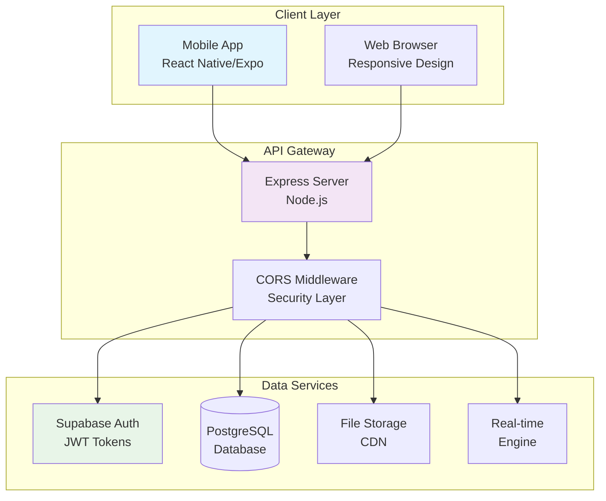
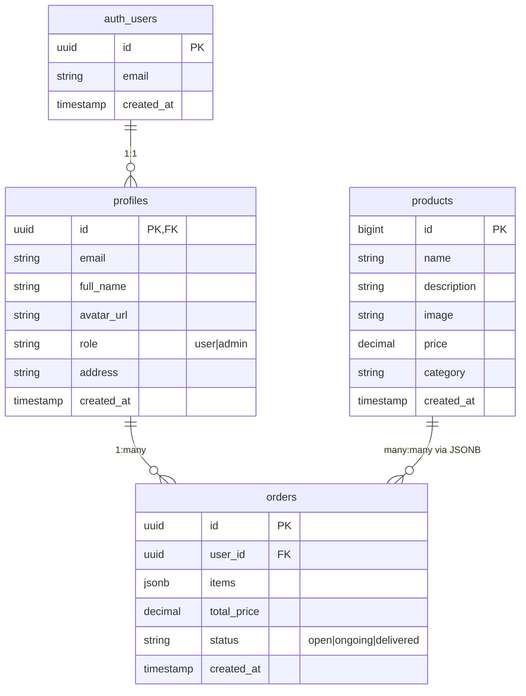
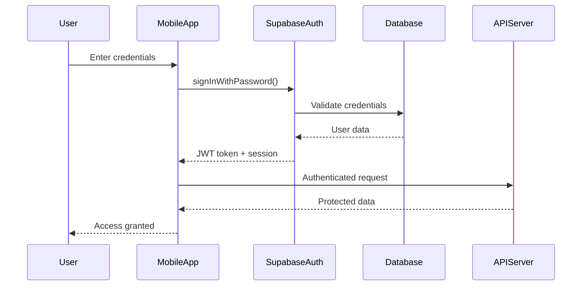
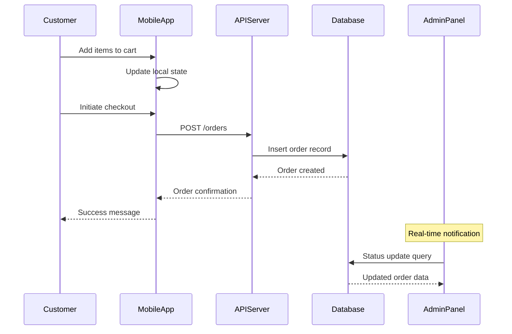
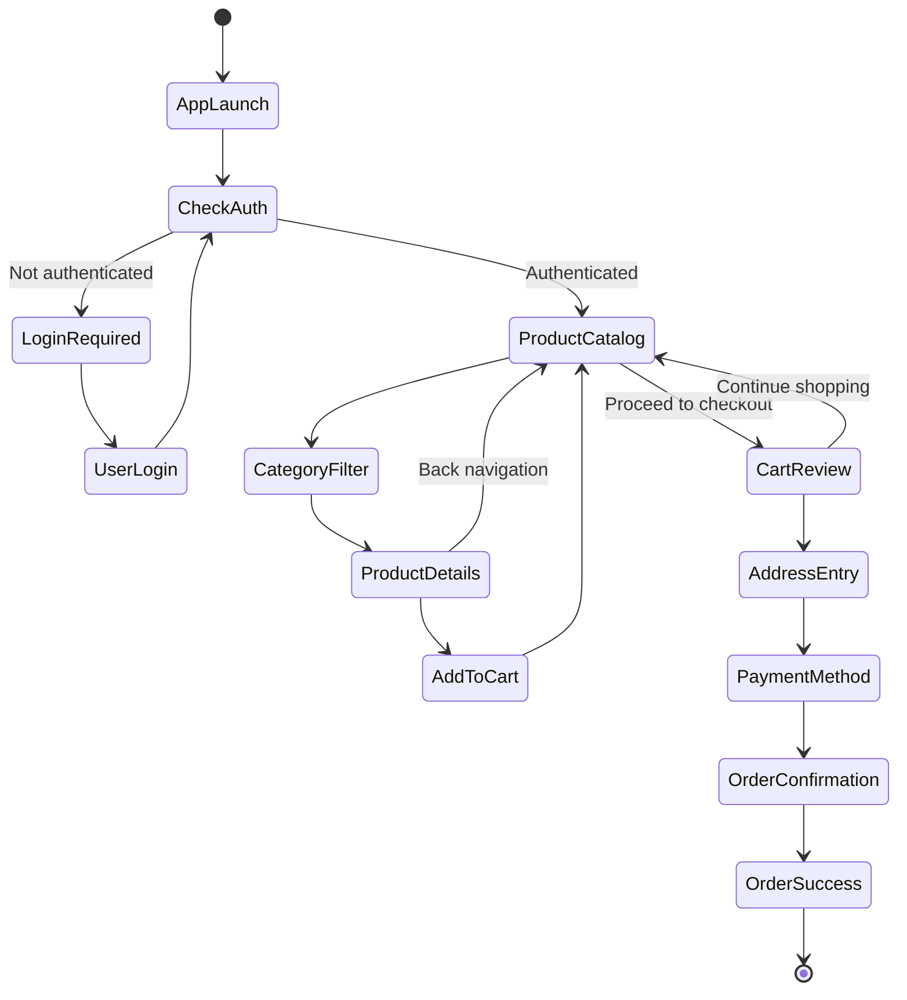

# System Design Documentation

---

## 1. System Architecture

### High-Level Architecture Overview

The e-commerce application follows a modern three-tier architecture with clear separation of concerns, enabling independent development, testing, and deployment of each component.

### Architecture Components

#### Presentation Layer (Mobile Application)

<div style="background: #e1f5fe; padding: 20px; border-radius: 8px; margin: 15px 0;">

**Framework Stack:**

- React Native 0.81.5 with Expo SDK 54+
- Expo Router for file-based navigation
- Zustand for client-side state management
- Supabase JS SDK for backend integration

**Key Features:**

- Cross-platform mobile application (iOS/Android)
- Responsive UI with native performance
- Offline-first cart functionality
- Real-time data synchronization

</div>

#### Application Layer (Backend API)

<div style="background: #f3e5f5; padding: 20px; border-radius: 8px; margin: 15px 0;">

**Technology Stack:**

- Node.js runtime environment
- Express.js web framework
- RESTful API design principles
- JWT authentication middleware

**Responsibilities:**

- Request validation and sanitization
- Business logic processing
- Database query optimization
- Error handling and logging

</div>

#### Data Layer (Supabase Platform)

<div style="background: #e8f5e8; padding: 20px; border-radius: 8px; margin: 15px 0;">

**Database Services:**

- PostgreSQL relational database
- Row Level Security (RLS) policies
- Real-time subscriptions
- File storage for product images

**Security Features:**

- Authentication service integration
- Role-based access control
- Data encryption at rest and in transit
- Automated backup and recovery

</div>

### System Architecture Diagram



### Data Flow Architecture

| Component            | Input             | Processing         | Output           |
| -------------------- | ----------------- | ------------------ | ---------------- |
| **Mobile App**       | User interactions | State management   | API requests     |
| **API Server**       | HTTP requests     | Business logic     | Database queries |
| **Database**         | SQL queries       | RLS policies       | Filtered data    |
| **Real-time Engine** | Data changes      | Event broadcasting | Live updates     |

---

## 2. Database Design (ERD)

### Entity-Relationship Diagram



### Entity Descriptions

#### auth.users Table

<div style="background: #fff3cd; padding: 15px; border-radius: 8px; margin: 10px 0;">

**Purpose:** Core authentication table managed by Supabase Auth service
**Relationships:** One-to-one with profiles table
**Key Constraints:** Primary key on id, unique email constraint

**Schema:**

- `id` (UUID, Primary Key) - Unique user identifier
- `email` (TEXT, Unique) - User email address
- `created_at` (TIMESTAMP) - Account creation timestamp

</div>

#### profiles Table

<div style="background: #d1ecf1; padding: 15px; border-radius: 8px; margin: 10px 0;">

**Purpose:** Extended user profile information and role management
**Relationships:** References auth.users, referenced by orders
**Security:** Row Level Security policies restrict access

**Schema:**

- `id` (UUID, Primary/Foreign Key) - Links to auth.users
- `email` (TEXT) - Denormalized for performance
- `full_name` (TEXT) - User's display name
- `avatar_url` (TEXT) - Profile picture URL
- `role` (TEXT) - Access level (user/admin)
- `address` (TEXT) - Shipping address
- `created_at` (TIMESTAMP) - Profile creation time

</div>

#### products Table

<div style="background: #d4edda; padding: 15px; border-radius: 8px; margin: 10px 0;">

**Purpose:** Product catalog with inventory information
**Relationships:** Referenced by orders via JSONB structure
**Indexing:** Optimized for search and filtering operations

**Schema:**

- `id` (BIGINT, Primary Key) - Auto-generated product ID
- `name` (TEXT) - Product display name
- `description` (TEXT) - Detailed product information
- `image` (TEXT) - Product image URL
- `price` (DECIMAL) - Product price with 2 decimal places
- `category` (TEXT) - Product categorization
- `created_at` (TIMESTAMP) - Product addition timestamp

</div>

#### orders Table

<div style="background: #f8d7da; padding: 15px; border-radius: 8px; margin: 10px 0;">

**Purpose:** Customer order records with status tracking
**Relationships:** References profiles for user association
**Data Structure:** JSONB items field for flexible order contents

**Schema:**

- `id` (UUID, Primary Key) - Unique order identifier
- `user_id` (UUID, Foreign Key) - Reference to customer profile
- `items` (JSONB) - Array of ordered products with quantities
- `total_price` (DECIMAL) - Calculated order total
- `status` (TEXT) - Order lifecycle state
- `created_at` (TIMESTAMP) - Order placement timestamp

</div>

### Database Constraints and Indexes

| Constraint Type | Table            | Columns | Purpose                      |
| --------------- | ---------------- | ------- | ---------------------------- |
| **Primary Key** | All tables       | id      | Unique record identification |
| **Foreign Key** | profiles, orders | user_id | Referential integrity        |
| **Unique**      | auth.users       | email   | Prevent duplicate accounts   |
| **Check**       | profiles         | role    | Valid role values only       |
| **Check**       | orders           | status  | Valid status values only     |

### Indexing Strategy

| Index Type | Table    | Columns  | Use Case                 |
| ---------- | -------- | -------- | ------------------------ |
| **B-tree** | products | name     | Text search optimization |
| **B-tree** | products | category | Category filtering       |
| **B-tree** | products | price    | Price range queries      |
| **B-tree** | orders   | user_id  | User order history       |
| **B-tree** | orders   | status   | Status-based filtering   |
| **GIN**    | orders   | items    | JSONB array operations   |

---

## 3. UML Diagrams

### Use Case Diagram

```mermaid
usecase "E-Commerce System" as System
actor Customer
actor Administrator

Customer --> (Register/Login)
Customer --> (Browse Products)
Customer --> (Add to Cart)
Customer --> (Manage Profile)
Customer --> (View Orders)
Customer --> (Checkout)

Administrator --> (Login as Admin)
Administrator --> (Manage Products)
Administrator --> (View Users)
Administrator --> (Manage Orders)

note right of (Manage Products)
  CRUD operations on
  product catalog
end note

note right of (Manage Orders)
  Update order status
  View all orders
end note
```

### Sequence Diagram - User Authentication Flow



### Sequence Diagram - Order Processing Flow



### Activity Diagram - Complete Shopping Workflow



---

## 4. UI/UX Design Specifications

### Screen Hierarchy and Navigation

```
Application Structure
├── Authentication Flow
│   ├── Splash Screen
│   ├── Welcome Screen
│   ├── Login Screen
│   └── Registration Screen
├── Main Application (Tab-based)
│   ├── Home (Product Catalog)
│   ├── Cart (Shopping Cart)
│   ├── Profile (User Account)
│   └── Admin (Conditional)
└── Modal Overlays
    ├── Product Details
    ├── Checkout Wizard
    └── Order Confirmation
```

### Screen Specifications

#### Product Catalog (Home Screen)

<div style="background: #f8f9fa; padding: 15px; border-radius: 8px; margin: 10px 0;">

**Layout:** Grid-based product display with horizontal scrolling categories
**Components:**

- Category filter tabs
- Search bar with autocomplete
- Product cards (image, title, price)
- Pull-to-refresh functionality

**Interactions:**

- Tap product card → Product detail modal
- Swipe categories → Filter products
- Pull down → Refresh product data

</div>

#### Product Detail Modal

<div style="background: #f8f9fa; padding: 15px; border-radius: 8px; margin: 10px 0;">

**Layout:** Full-screen modal with image carousel and details
**Components:**

- Image gallery with zoom
- Product title and description
- Price and availability
- Quantity selector
- Add to cart button

**Interactions:**

- Swipe images → Gallery navigation
- Tap quantity → Increment/decrement
- Add to cart → Toast notification + cart update

</div>

#### Shopping Cart Screen

<div style="background: #f8f9fa; padding: 15px; border-radius: 8px; margin: 10px 0;">

**Layout:** List view with item cards and summary footer
**Components:**

- Cart item list with images
- Quantity controls per item
- Item total calculations
- Cart summary (subtotal, tax, total)
- Checkout button

**Interactions:**

- Swipe item → Remove option
- Tap quantity → Edit modal
- Checkout tap → Validation and navigation

</div>

#### Checkout Flow (Multi-step Modal)

<div style="background: #f8f9fa; padding: 15px; border-radius: 8px; margin: 10px 0;">

**Step 1 - Cart Review:**

- Item list with final quantities
- Remove/edit options
- Subtotal display

**Step 2 - Shipping Information:**

- Address form fields
- Save for future use option
- Validation feedback

**Step 3 - Payment Method:**

- Payment option selection
- Security indicators
- Terms acceptance

**Step 4 - Order Confirmation:**

- Final order summary
- Place order button
- Loading states

</div>

#### Admin Dashboard

<div style="background: #fff3cd; padding: 15px; border-radius: 8px; margin: 10px 0;">

**Layout:** Dedicated admin interface with management tools
**Components:**

- Product management form
- Order status dashboard
- User management (view only)
- Analytics summary

**Security:** Role-based access control, admin-only visibility

</div>

### Design System Specifications

#### Color Palette

| Color Name         | Hex Code | Usage                           |
| ------------------ | -------- | ------------------------------- |
| **Primary Blue**   | #007AFF  | Buttons, links, active states   |
| **Secondary Gray** | #6C757D  | Secondary text, borders         |
| **Success Green**  | #28A745  | Confirmations, positive actions |
| **Warning Yellow** | #FFC107  | Warnings, admin elements        |
| **Danger Red**     | #DC3545  | Errors, destructive actions     |
| **Background**     | #FFFFFF  | Primary background              |
| **Surface**        | #F8F9FA  | Cards, secondary backgrounds    |

#### Typography Scale

| Text Style     | Font Size | Font Weight | Usage             |
| -------------- | --------- | ----------- | ----------------- |
| **Headline 1** | 24px      | Bold        | Screen titles     |
| **Headline 2** | 20px      | Bold        | Section headers   |
| **Body Large** | 16px      | Regular     | Primary content   |
| **Body**       | 14px      | Regular     | Secondary content |
| **Caption**    | 12px      | Regular     | Metadata, labels  |
| **Button**     | 16px      | Medium      | Button text       |

#### Component Specifications

| Component            | Height   | Padding         | Border Radius | Shadow             |
| -------------------- | -------- | --------------- | ------------- | ------------------ |
| **Button Primary**   | 44px     | 16px horizontal | 8px           | Subtle drop shadow |
| **Button Secondary** | 44px     | 16px horizontal | 8px           | Border only        |
| **Card**             | Variable | 16px            | 12px          | Light shadow       |
| **Input Field**      | 48px     | 12px            | 8px           | Border focus state |
| **Tab Bar**          | 60px     | 8px vertical    | 0px           | Top border         |

---

## 5. API Design Specifications

### RESTful API Architecture

#### Authentication Endpoints

##### POST /auth/login

<div style="background: #e8f5e8; padding: 15px; border-radius: 8px; margin: 10px 0;">

**Purpose:** Authenticate user credentials and establish session

**Request Body:**

```json
{
  "email": "user@example.com",
  "password": "securepassword123"
}
```

**Response (200):**

```json
{
  "user": {
    "id": "uuid-string",
    "email": "user@example.com",
    "role": "user"
  },
  "session": {
    "access_token": "jwt-token",
    "refresh_token": "refresh-jwt",
    "expires_at": 1640995200
  }
}
```

**Error Responses:**

- `400`: Invalid credentials
- `429`: Too many attempts

</div>

##### POST /auth/register

<div style="background: #e8f5e8; padding: 15px; border-radius: 8px; margin: 10px 0;">

**Purpose:** Create new user account

**Request Body:**

```json
{
  "email": "newuser@example.com",
  "password": "securepassword123",
  "full_name": "John Doe",
  "accept_terms": true
}
```

**Response (201):**

```json
{
  "user": {
    "id": "uuid-string",
    "email": "newuser@example.com"
  },
  "message": "Account created successfully"
}
```

</div>

#### Product Management Endpoints

##### GET /products

<div style="background: #d1ecf1; padding: 15px; border-radius: 8px; margin: 10px 0;">

**Purpose:** Retrieve paginated product catalog

**Query Parameters:**

- `page` (integer, default: 1) - Page number
- `limit` (integer, default: 20) - Items per page
- `category` (string) - Filter by category
- `search` (string) - Search in product names
- `min_price` (decimal) - Minimum price filter
- `max_price` (decimal) - Maximum price filter
- `sort` (string) - Sort field (name, price, created_at)
- `order` (string) - Sort direction (asc, desc)

**Response (200):**

```json
{
  "products": [
    {
      "id": 1,
      "name": "Wireless Headphones",
      "description": "Premium wireless audio experience",
      "image": "https://cdn.example.com/product1.jpg",
      "price": 149.99,
      "category": "Electronics",
      "created_at": "2024-01-01T00:00:00Z"
    }
  ],
  "pagination": {
    "page": 1,
    "limit": 20,
    "total": 150,
    "total_pages": 8
  }
}
```

</div>

##### POST /products (Admin Only)

<div style="background: #fff3cd; padding: 15px; border-radius: 8px; margin: 10px 0;">

**Purpose:** Create new product (Admin authorization required)

**Request Body:**

```json
{
  "name": "New Product",
  "description": "Product description",
  "price": 99.99,
  "category": "Electronics",
  "image": "https://cdn.example.com/new-product.jpg",
  "inventory_count": 50
}
```

**Authorization:** Bearer token with admin role

</div>

#### Order Management Endpoints

##### POST /orders

<div style="background: #d4edda; padding: 15px; border-radius: 8px; margin: 10px 0;">

**Purpose:** Create new customer order

**Request Body:**

```json
{
  "items": [
    {
      "product_id": 1,
      "quantity": 2,
      "price": 149.99
    },
    {
      "product_id": 3,
      "quantity": 1,
      "price": 79.99
    }
  ],
  "shipping_address": {
    "street": "123 Main St",
    "city": "Anytown",
    "state": "CA",
    "zip_code": "12345",
    "country": "USA"
  },
  "payment_method": "credit_card"
}
```

**Response (201):**

```json
{
  "order": {
    "id": "order-uuid",
    "user_id": "user-uuid",
    "items": [...],
    "total_price": 379.97,
    "status": "confirmed",
    "created_at": "2024-01-01T12:00:00Z"
  }
}
```

</div>

##### GET /orders

<div style="background: #d1ecf1; padding: 15px; border-radius: 8px; margin: 10px 0;">

**Purpose:** Retrieve user orders (or all orders for admin)

**Query Parameters:**

- `status` (string) - Filter by order status
- `page` (integer) - Pagination page
- `limit` (integer) - Items per page

**Response (200):**

```json
{
  "orders": [
    {
      "id": "order-uuid",
      "user_id": "user-uuid",
      "items": [...],
      "total_price": 379.97,
      "status": "confirmed",
      "created_at": "2024-01-01T12:00:00Z",
      "updated_at": "2024-01-01T12:30:00Z"
    }
  ],
  "pagination": {
    "page": 1,
    "total": 25,
    "total_pages": 3
  }
}
```

</div>

### API Security and Standards

#### Authentication

- **JWT Bearer Tokens** in Authorization header
- **Token Expiration** with automatic refresh
- **Role-based Access** control for admin endpoints

#### Rate Limiting

| Endpoint Type        | Limit        | Window     |
| -------------------- | ------------ | ---------- |
| **Authentication**   | 5 requests   | 15 minutes |
| **Product Queries**  | 100 requests | 15 minutes |
| **Order Operations** | 20 requests  | 15 minutes |
| **Admin Operations** | 50 requests  | 15 minutes |

#### Error Response Format

```json
{
  "error": {
    "code": "VALIDATION_ERROR",
    "message": "Invalid input parameters",
    "details": {
      "field": "email",
      "reason": "Invalid email format"
    }
  },
  "timestamp": "2024-01-01T12:00:00Z",
  "request_id": "req-uuid"
}
```

#### HTTP Status Codes

| Code    | Meaning               | Usage                          |
| ------- | --------------------- | ------------------------------ |
| **200** | OK                    | Successful GET requests        |
| **201** | Created               | Successful resource creation   |
| **400** | Bad Request           | Validation errors              |
| **401** | Unauthorized          | Missing/invalid authentication |
| **403** | Forbidden             | Insufficient permissions       |
| **404** | Not Found             | Resource not found             |
| **429** | Too Many Requests     | Rate limit exceeded            |
| **500** | Internal Server Error | Server-side errors             |

---

_This system design document provides comprehensive technical specifications for the e-commerce platform, ensuring scalable, secure, and maintainable architecture._
