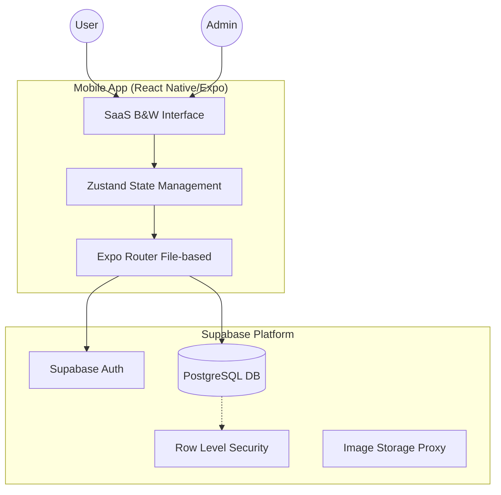
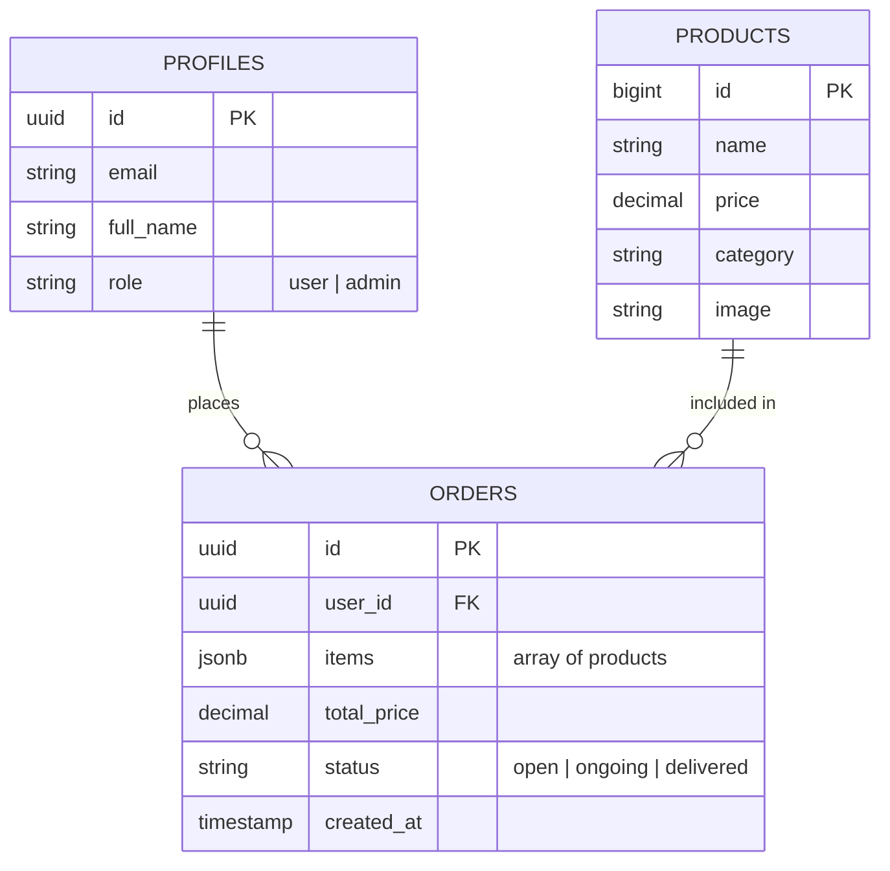

# Design Documents

## 1. System Architecture

The application follows a modern decoupled architecture using a mobile frontend and a backend-as-a-service (BaaS).

## 2. Database Schema (ERD)

The database is structured to support role-based access and order tracking.

## 3. UI/UX Philosophy

- **Minimalism**: Focus on product imagery and clear typography.
- **Contrast**: Using #000 and #FFF to create a premium SaaS feel.
- **Feedback**: Micro-animations for loading states and instant success feedback for transactions.

## 4. API Design

While the app communicates directly with Supabase via the `supabase-js` SDK, it follows a RESTful pattern for resource access:

- `GET /products`: Fetch products (filtered by RLS).
- `POST /orders`: Secure insert for authenticated users.
- `PATCH /orders/:id`: Status updates restricted to Admin role.
